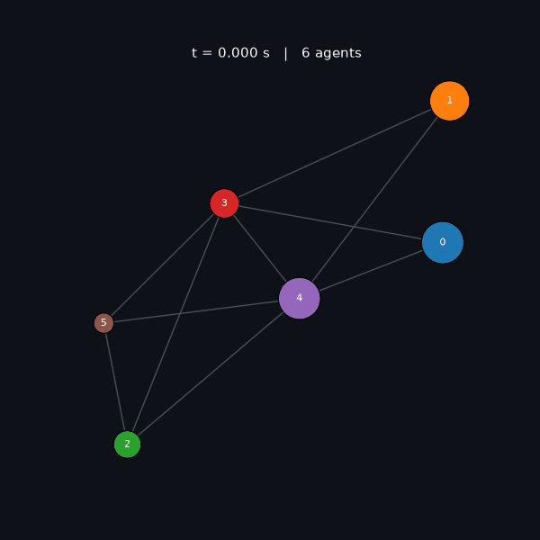

# median-consensus-multi-agent-system

Simulator + interactive GUI for the non-smooth median-consensus protocol from:

> Z. A. Z. Sanai Dashti, C. Seatzu, M. Franceschelli, *"Dynamic Consensus on the Median
> Value in Open Multi-Agent Systems"*, IEEE Transactions on Automatic Control.

This is an **independent, from-scratch implementation** of the mathematical protocol
described in the paper (equations, not text or figures). Algorithms and formulas are not
copyrightable — only the paper's specific text/figures are, and neither is reproduced
here. The PDF itself is not included in this repository.

## The protocol

Each agent $i$ holds a state $x_i$ and a time-varying reference $u_i(t)$. Over a graph
$G(t)$:

$$\dot x_i = -\lambda \sum_{j\in N_i} \text{sign}(x_i - x_j) - \alpha\ \text{sign}(x_i - u_i)$$

$\lambda$ pulls neighbors to agreement, $\alpha$ pulls each agent toward its own
reference. Because $\text{sign}$ is discontinuous, trajectories are simulated as Filippov solutions via small-step
explicit Euler (standard practice for sliding-mode / non-smooth consensus dynamics).

Two settings are implemented:

- **Closed network** (Theorem 4.1/4.2): fixed graph, agents reach consensus in finite time
  on the median of their (moving) references, provided $n\Pi \lt \alpha \lt 2\lambda/n$.
- **Open network** (Theorem 4.3): agents join/leave with a minimum dwell time $\Delta\tau$; a
  joining agent starts at the mean of its neighbours (eq. 6). Consensus error stays
  bounded by $B$ instead of vanishing, provided $B \leq (\alpha/n_{max} - \Pi)\Delta\tau$.



Open network with 6→18 agents joining/leaving over 1.5 s. Node color is fixed per agent id
(identity), node size tracks the agent's current state $x_i$ — both are frozen to a single
layout computed once over every agent that ever appears, so a surviving agent never jumps
position or color, only size. Regenerate with `python scripts/make_demo_gif.py`.

## Run

```bash
pip install -r requirements.txt
python -m tests.test_dynamics   # sanity checks
streamlit run app.py            # GUI
```

The GUI lets you pick closed/open scenario, tune $\lambda$, $\alpha$, graph size, dwell time and
reference band $B$, run the simulation, and watch every agent's state converge (or track)
the median live, together with the theoretical bounds ($T_1$, $B$) overlaid on the error
curve.

## Real-data references

The closed-network scenario can be driven by an actual dataset instead of synthetic
sinusoids — pick it in the sidebar under "Reference signals":

- **PM2.5 dataset (demo)** — `data/pm25_demo.csv`, the 6-sensor PM2.5 time series
  (McAllen, Midlothian, Midland, Houston, Austin, Del Rio — Texas, Sep–Oct 2021, one
  reading every 2 minutes) from
  [CNN-and-RNN-regression](https://github.com/giorgio0420/CNN-and-RNN-regression)'s LSTM
  notebook.
- **Upload your own CSV** — any file with a timestamp column (first column; ISO
  datetimes or plain numeric seconds both work) and one column per agent. No schema is
  assumed beyond that (`dynamic_consensus/data_source.py`), so a differently-shaped
  dataset just works.

In real-data mode $n$ is set to the number of signal columns automatically, and the only
controls left are $\lambda$, $\alpha$, $dt$, `seed`, and the **network topology** — "Fully connected"
(every agent sees every other) or "Random (Erdős–Rényi)" with an adjustable edge
probability $p$. The graph is otherwise chosen freely in the synthetic scenario
(`p_edge=0.5` internally) — real-data mode surfaces the choice explicitly instead of
picking one silently.

**The reference is piecewise-constant, not interpolated — this is the key design choice.**
Interpolating between raw samples and integrating at a $dt$ fine enough for a fast protocol
($\lambda$ in the 50–200 range) means hundreds of thousands of Euler steps for even a short
real-time window — too slow for a pure-Python loop, and it forced an awkward choice between
a tiny window or an impractically small $\lambda$. Instead, `build_stepwise_reference`
(`data_source.py`) splits the **entire file** into blocks — row-averaged, so every row
contributes regardless of file length — sized so the whole run fits the step budget
(`MAX_REAL_DATA_STEPS`, ~15s of computation). Each block is held as a *constant* target for
a fixed dwell, then jumps to the next block's average; agents keep converging/tracking
continuously across the jumps, never resetting. A step-plot preview shows exactly this
sequence (not a smoothed curve) before you press Run.

This maps onto the paper's own Sec. 10 argument for network events, rather than Thm 4.2,
which assumes a reference drifting continuously at up to $\Pi$: the target here is exactly
constant *within* a block (no drift to fight, so no lower
bound on $\alpha$ from $\Pi$), and the only thing that can hurt tracking is the jump between
consecutive block medians ($b_{jump}$, analogous to Thm 4.3's $B$). The sidebar alert
checks $b_{jump} \leq (\alpha/n)\cdot\text{dwell}$ — `stepwise_gain_report` in `dynamics.py` — and there's no $n_{max}$
or dwell-time assumption to satisfy, since a fixed dataset has no join/leave events.

Two things worth knowing before trusting the plots:

- **A handful of real sensor spikes dominate the block jumps.** PM2.5 readings swing by
  double digits in Texas air-quality events; averaging into ~75 blocks smooths out
  single-sample glitches (like the raw ~190 µg/m³ 2-minute jump in the Houston sensor) but
  not the underlying real spikes, so $b_{jump}$ still comes out large enough to violate the
  default gains. It's a live example of the paper's own soft spot noted below: a handful of
  outliers force gains sized for the worst jump, everywhere, for all time.
- **Explicit Euler still needs $dt \lesssim 1/(\lambda\cdot\text{max degree})$, independent
  of the gain conditions** — the same numerical-stability warning fires here as everywhere else in the
  app; a coarser $dt$ needs a smaller $\lambda$ to stay accurate.

## Math reference

Notation: $x_i(t)$ state, $u_i(t)$ reference, $N_i(t)$ neighbours, $n(t) \leq n_{max}$
agents, $\lambda$ coupling gain, $\alpha$ fidelity gain, $\Pi$ bound on $|\dot u_i|$, $B$
reference band width, $\Delta\tau$ minimum dwell time between network events.

**Median (Def. 3.1).** Not "sorted middle element" — variational:

$$\chi(t) = \arg\min_{\bar u} \sum_j |u_j(t) - \bar u|$$

For $n$ even the minimizer is a pair; $m(u)$ is their mean and $M(u) = [\min, \max]$ is
the median interval, length $L_M$. Absolute value gives the median (vs. squared error giving
the mean) — that's why the protocol below uses $\text{sign}$ where linear consensus uses the
Laplacian.

**Protocol (eq. 5).**

$$\dot x_i = -\lambda \sum_{j\in N_i(t)} \text{sign}(x_i - x_j) - \alpha\ \text{sign}(x_i - u_i)$$

with $\text{sign}(0)=0$ for the ODE, and the set-valued $\text{SIGN}(0)=[-1,1]$ for the
Filippov analysis below. In matrix form ($E$ incidence matrix, $L=EE^{T}$): linear
consensus is $\dot x=-Lx$, this protocol is
$\dot x = -\lambda E\cdot\text{sign}(E^{T}x) - \alpha\cdot\text{sign}(x-u)$ — same graph
structure, $\text{sign}$ replaces the raw disagreement. Consequence: the algebraic
connectivity $\lambda_2$ does not appear in the convergence rate; only $n_{max}$,
$\lambda$, $\alpha$ do.

**Join rule (eq. 6).** A joining agent starts at the mean of its neighbours:

$$x_i(t) = \frac{1}{|N_i(t)|}\sum_{j\in N_i(t)} x_j(t)$$

so it lands in the convex hull of existing states — it can never become the new max/min,
which is what keeps the Lyapunov argument valid across join events (§ below).

**Non-smooth machinery (Defs. 2.1–2.3, needed because $\text{sign}$ is discontinuous).**

*Filippov solution* — replace the ODE with a differential inclusion:

$$\dot x \in K(x) \triangleq \bigcap_{\delta>0}\ \bigcap_{\mu(N)=0} \overline{\text{co}}\lbrace f(B(x,\delta)\setminus N,\ t)\rbrace$$

At a discontinuity the derivative becomes the convex hull of the one-sided limits
($K(0)=[-1,1]$ for $\text{sign}$). The field of eq. 5 is measurable and uniformly bounded, so a
Filippov solution exists for every initial condition.

*Clarke gradient* — same idea applied to a locally Lipschitz Lyapunov function $V$:

$$\partial V(x) \triangleq \text{co}\Big\lbrace\lim_{i\to\infty}\nabla V(x_i)\ \Big|\ x_i\to x,\ x_i\notin\Omega_V\cup N\Big\rbrace$$

For $V(x)=|x|$: $\partial V(0)=[-1,1]$, the same object as $\text{SIGN}(0)$.

*Set-valued Lie derivative* —

$$\tilde{\mathcal L}V(x) \triangleq \lbrace a\in\mathbb R\ |\ \exists v\in K(x):\ \zeta\cdot v = a\ \ \forall \zeta\in\partial V(x)\rbrace$$

*Theorem 2.5 (finite-time convergence).* If $V=0$ on the consensus subspace, $V \gt 0$
elsewhere, and $dV/dt \leq -\varepsilon \lt 0$ a.e. off the subspace, then $V$ (and $x$)
reach it by $t = V(x(0))/\varepsilon$. A constant-slope bound integrates to a straight line hitting zero at a
finite time — unlike smooth consensus ($\dot V \leq -cV$ integrates to an exponential that never
truly reaches zero). This is why $\text{sign}$-based consensus is finite-time.

**Theorem 4.1 — consensus (closed or open network).** With $0 \lt \alpha \lt 2\lambda/n_{max}$, all agents agree within
$`T_1 = (\max_i x_i(0) - \min_i x_i(0))/\mu_2`$, where $`\mu_2 = 2(2\lambda/n_{max} - \alpha)`$,
using the Lyapunov function

$$V_1(x) = \text{mean}_{i\in I_{max}} x_i - \text{mean}_{i\in I_{min}} x_i$$

(gap between the top group and bottom group). A joining agent leaves $V_1$ unchanged
(eq. 6 keeps it inside the convex hull); a leaving agent can only shrink $V_1$ — so the
closed-network bound survives network churn unchanged.

**Theorem 4.2 — the consensus value is the median (closed network only).** With
$n\Pi \lt \alpha \lt 2\lambda/n$, the common value $c(t)$ enters the median interval
$M(u(t))$ in finite time. Summing eq. 5 over all agents cancels the coupling term (undirected graph), leaving
$\dot c = -(\alpha/n) \sum \text{sign}(c - u_i)$: a majority vote among agents whose
reference is above or below $c$, strength at least $\alpha/n$, against a median that drifts
at most $\Pi$ — negative net drift iff $\alpha \gt n\Pi$.

**Theorem 4.3 — bounded error (open network).** With $`n_{max}\Pi \lt \alpha \lt 2\lambda/n_{max}`$ and

$$B \le \left(\frac{\alpha}{n_{max}} - \Pi\right)\Delta\tau$$

the tracking error $|c(t) - m(u(t))| \leq B$ for all $t \geq T_3$ (bounded, not zero — the price
of allowing agents to join/leave). Each network event can move the median by at most `B`;
between events the continuous dynamics shrinks the error by $(\alpha/n_{max} - \Pi)\Delta\tau$. The
condition above is exactly "net decrement per dwell period $D \gt 0$".

## Layout

```
dynamic_consensus/
  dynamics.py     protocol RHS, median/interval, Lyapunov V1, gain reports
  graphs.py       random connected graph generator, join-attachment rule
  simulate.py     closed-network and open-network integrators
  data_source.py  CSV -> reference signal (real-data mode)
  viz.py          shared layout/color helpers (app + demo GIF)
app.py            Streamlit GUI
scripts/          demo GIF renderer
data/             bundled PM2.5 dataset
tests/            assert-based self-checks
```
